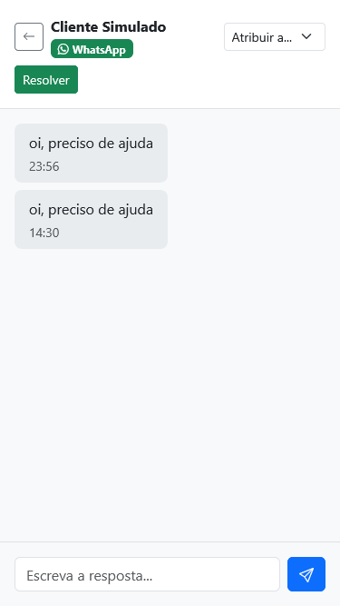

# Inbox Omnichannel

[](https://github.com/luciolimap/inbox-omnichannel/actions/workflows/ci.yml?query=branch%3Amain)

Caixa de entrada única para mensagens de Telegram, WhatsApp e e-mail: a mensagem
chega pelo canal, o agente responde na web, e a resposta sai pelo mesmo canal.


## Rodar

```bash
cp .env.example .env     # ajuste JWT_SECRET e INTERNAL_TOKEN
docker compose up -d --build
```

Abra <http://localhost:8081> e entre com `agente@smartspace.test` / `senha123`.

Esse par é semeado só fora de produção. Em servidor exposto, ponha no `.env`:

```bash
SPRING_PROFILES_ACTIVE=prod
SEED_ADMIN_PASSWORD=<uma senha sua>
```

Com `prod` ativo o core não sobe sem `SEED_ADMIN_PASSWORD`, para nenhuma
instância nascer com senha conhecida.

Sem token do Telegram o inbox funciona inteiro pelos canais simulados: o botão
**Simular** injeta uma mensagem pelo mesmo contrato de webhook que o Telegram usa.

Para ligar o Telegram de verdade: crie um bot no `@BotFather`, ponha o token em
`TELEGRAM_BOT_TOKEN` no `.env`, escolha um valor qualquer para
`TELEGRAM_WEBHOOK_SECRET`, exponha a porta 3000 e registre o webhook com esse
mesmo segredo:

```bash
curl -s "https://api.telegram.org/bot$TELEGRAM_BOT_TOKEN/setWebhook?url=<url-publica>/webhooks/telegram&secret_token=$TELEGRAM_WEBHOOK_SECRET"
```

O gateway recusa update que não traga o segredo de volta no header
`X-Telegram-Bot-Api-Secret-Token`, e sobe com erro se o bot estiver configurado
sem ele — webhook registrado sem `secret_token` tomaria 401 em todo update.

## Por que três serviços

`gateway` (Node) é a borda. Recebe webhook de canal e tem um único trabalho:
responder 200 rápido, porque 4xx faz o Telegram reentregar o mesmo update em laço.
Ele traduz o payload cru de cada canal para um contrato interno único e mantém as
conexões WebSocket do navegador.

`core` (Java) é o domínio. Autenticação, contatos, conversas, mensagens, tudo em
transação no PostgreSQL. Não sabe o que é Telegram: recebe `InboundRequest` com um
canal e um id externo.

A fronteira existe por esse descasamento — borda precisa de latência, domínio
precisa de transação. Trocar o adapter simulado de WhatsApp por um real não muda
uma linha do `core`; é o teste que a abstração tem de passar.

## Decisões e seus limites

| Decisão | Por quê | O que faria em produção |
|---|---|---|
| JWT stateless, sem refresh | Logout imediato não é requisito aqui | Refresh rotativo com blocklist; hoje revogar exige esperar o TTL |
| Idempotência por índice único em `external_id` | O banco é o único ponto que vê todas as réplicas | Igual, mais uma fila com entrega pelo menos uma vez |
| `deliveryStatus = FAILED` sem reenvio | Perder a mensagem é pior que não reentregá-la | Fila com repetição e recuo exponencial |
| WhatsApp e e-mail simulados | Credencial e aprovação não cabem em uma semana | Adapter real pelo mesmo contrato |
| Front-end recarrega a conversa a cada evento | Aplicar o delta divergiria em silêncio | Delta no estado, quando o volume justificar |

## Testes

```bash
cd core && ./mvnw test      # domínio + Testcontainers com PostgreSQL real
cd gateway && npm test      # contrato de canal e rotas
```

## Interface no celular



## Pipeline

Cinco jobs no GitHub Actions a cada push: `tsc --noEmit` no gateway, `tsc -b --noEmit`
no web, `./mvnw -B test` no core com Testcontainers, `npm test` no gateway e
`docker build` das três imagens. O `build-images` só roda se os quatro anteriores
passarem.

## Stack

Java 21 · Spring Boot 3.5.16 · Spring Security · JPA · Flyway · PostgreSQL 16 ·
Node 24 · TypeScript · Fastify 5 · React 19 · Bootstrap 5 · Docker Compose · GitHub Actions
